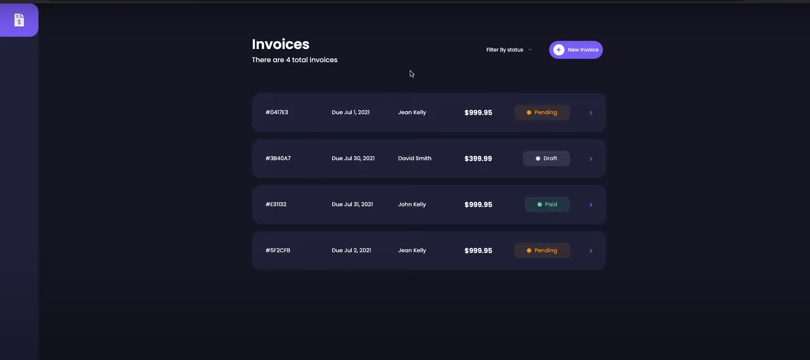

# INVOICE App

This repo contains the UI code that powers the Invoice app. 

## Table of Contents

1. [Install](#install)
2. [Contributing](#contributing)
3. [Contact](#contact)

## Install

1. Clone (or [fork](https://help.github.com/articles/fork-a-repo/)) this repository: `git clone https://github.com/Ines-Bouguerra/invoice-app.git`
2. Change directory into the cloned repository: `cd invoice-app`
3. Install the dependencies: `yarn`

#### Run the app

`yarn serve`

- If you want to build and launch the production app you can run `yarn build`. This will give you an executable inside the `/dist` folder.

## Contributing
We :heart: contributions from everyone and contributions to this project are encouraged, and compensated. We welcome [bug reports](https://github.com/Ines-Bouguerra/invoice-app/issues/), [bug fixes](https://github.com/Ines-Bouguerra/invoice-app/pulls) and feedback is always appreciated. For more details, see [CONTRIBUTING.md](CONTRIBUTING.md).

## 

## Contact

The primary contact for this project is [@ines](https://github.com/Ines-Bouguerra).
